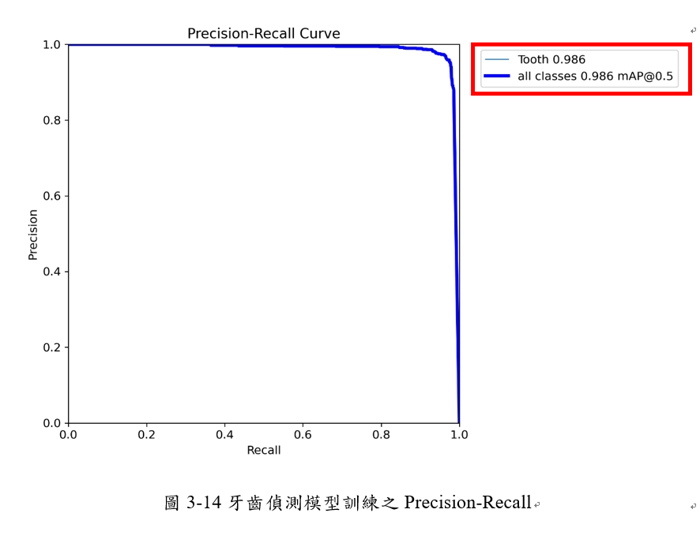
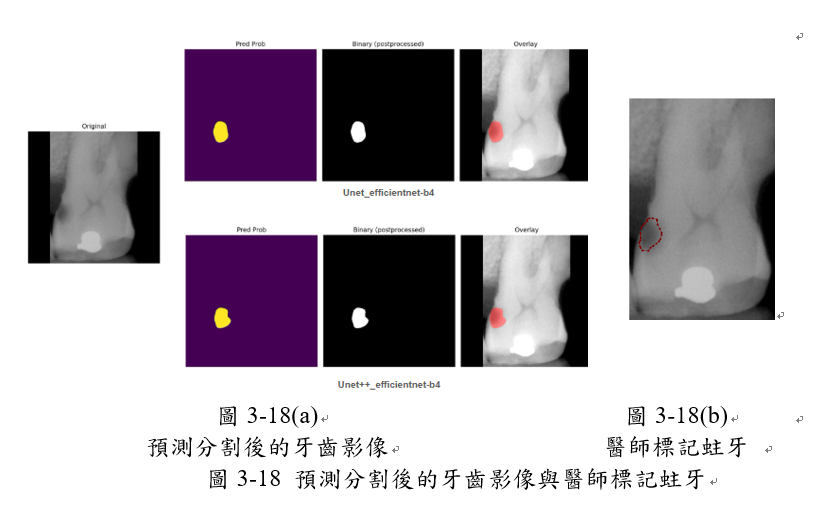
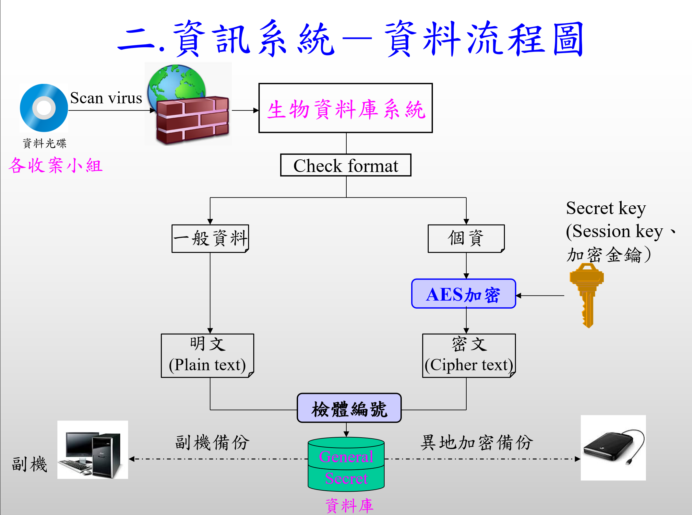
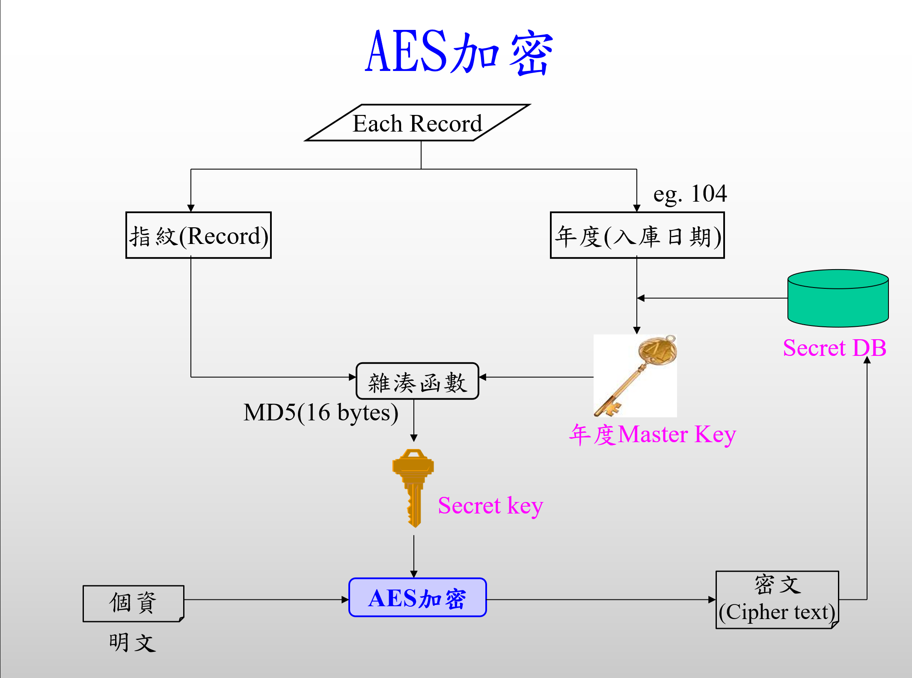
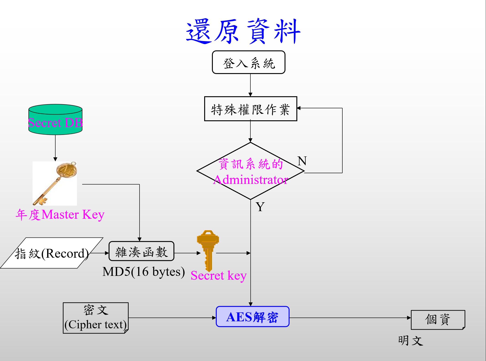

# 產學合作專案總覽

## 專案摘要

本文件整理與花蓮慈濟醫學中心共同執行的兩項產學合作計畫：

1. 牙科蛀牙 AI 系統開發
2. 人體生物資料庫資訊系統優化

重點涵蓋醫療影像 AI 研發、系統整合、資料隱私保護、以及金鑰管理機制。

---

## 專案亮點一覽

| 專案                       | 核心目標                         | 主要成果                              | 風險與管理要點                     |
| -------------------------- | -------------------------------- | ------------------------------------- | ---------------------------------- |
| 牙科蛀牙 AI 系統開發       | 牙齒偵測、牙位編號、蛀牙辨識     | 2 秒判讀、Line Bot 整合、影像診斷輸出 | 專家標記資料、模型訓練與驗證       |
| 人體生物資料庫資訊系統優化 | 高敏感生物樣本資料管理、資安強化 | 系統優化、規範遵循、保密機制建立      | AES-256 金鑰管理、研究人員保密制度 |

---

## 1. 牙科蛀牙 AI 系統開發

### 1.1 計畫背景

- 與花蓮慈濟醫學中心牙科專家合作，建立 AI 輔助診斷流程。
- 收集 300 位病患之根尖片 (PA) 與全景 X 光影像 (PANO)。
- 邀請資深牙科醫師協助標記蛀牙，建立高品質訓練資料集。

### 1.2 計畫目標

- 設計高準確率、低延遲、可視化診斷輸出即時輔助判讀系統、提升牙科影像判讀效率及正確性。
- 達成3個主要功能
  1. 牙齒偵測 (YOLOv8)
  2. 牙位編號
  3. 蛀牙辨識 (U-Net++)

### 1.3 系統架構、實驗結果與評估

- 採用雙階段深度學習架構：YOLOv8 進行牙齒偵測，U-Net++ 進行蛀牙分割。
- 影像前處理與資料增強包括：亮度調整、雙邊濾波、CLAHE濾波 等。
- [標記牙齒](標記牙齒.jpg)
- [標記蛀牙](標記蛀牙.jpg)
- [蛀牙分割-數據增強](蛀牙分割-數據增強.jpg)
- [研究架構.jpg](研究架構.jpg)
- 牙齒偵測訓練Precision-Recall Curve：
  - 
- 預測蛀牙分割與醫師標記比較
  - 
- 主要評估指標：
  - Precision 94.26%
  - Recall 96.81%
  - F1-score 95.50%
- 與先前研究進行間接比較（影像資料集不同）。

### 1.4 成果摘要

- 影像上傳後可透過 Line Bot 快速回傳診斷結果。
- 系統整體回應時間約 **2 秒**。
- 生成高準確率及辨識率的牙齒、蛀牙診斷影像，顯著提升判讀速度與可視化呈現。-
- [LineBot 成果](LineBot成果.jpg)
- [111_牙科蛀牙AI系統開發產學合作_海報_吳志成.pdf](111_牙科蛀牙AI系統開發產學合作_海報_吳志成.pdf)

---

## 2. 人體生物資料庫資訊系統優化

### 2.1 計畫背景

- 本計畫針對高度敏感的人體生物樣本與基因資料庫資訊系統進行優化。
- 依循衛生福利部「人體生物資料庫資訊安全規範」，確保資料保護與合規性。
- 系統採用正、副主機設置，並執行實體隔離以避免外部網路連線風險。
- 花蓮慈濟醫學中心自 110 年起至 115 年連續 5 年與本校簽訂產學合作，並簽署研究人員保密聲明書。
- 參與計畫人員都簽有:人體生物資料庫工作人員保密承諾書並通過6小時台灣學術研究倫理教育課程

### 2.2 優化成果

- 優化資訊系統管理機制，提升生物資料庫資料存取與使用安全。
- 建立嚴密資訊系統加/解密機制，確保資料處理流程符合倫理與法規要求。
- 提供完整的資安防護策略，避免基因資料洩露及系統資安風險。

### 2.3 金鑰管理機制

- 金鑰儲存於 `BioBank_Conn.dll`。
- 金鑰用途：僅用於生成年度金鑰，不直接用於資料加/解密。
- 資料加/解密流程：
  1. 以「年度金鑰 + 檢體編號」產生 Session Key。
  2. 使用 AES-256 進行資料加密。
- 系統特色：每筆資料使用獨立 Session Key 進行加/解密，使用次數少可大幅提高金鑰安全與資料安全。

### 2.4 成果摘要

- [111_人體生物資料庫產學合作_海報_吳志成.pdf](111_人體生物資料庫產學合作_海報_吳志成.pdf)
- [110_人體生物資料庫產學合作_海報_吳志成.pdf](110_人體生物資料庫產學合作_海報_吳志成.pdf)

### 2.5 資訊系統－資料流程圖

- 系統資料流程圖
  
- AES加密
  
- AES解密-還原資料
  
